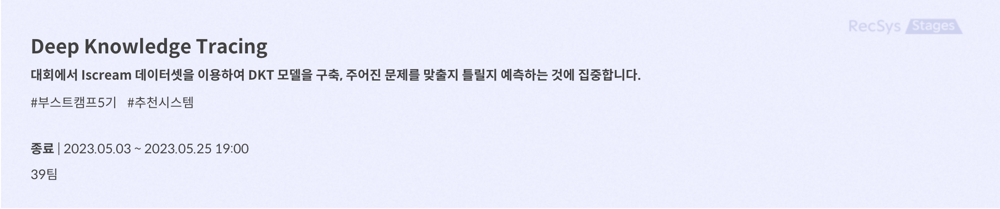
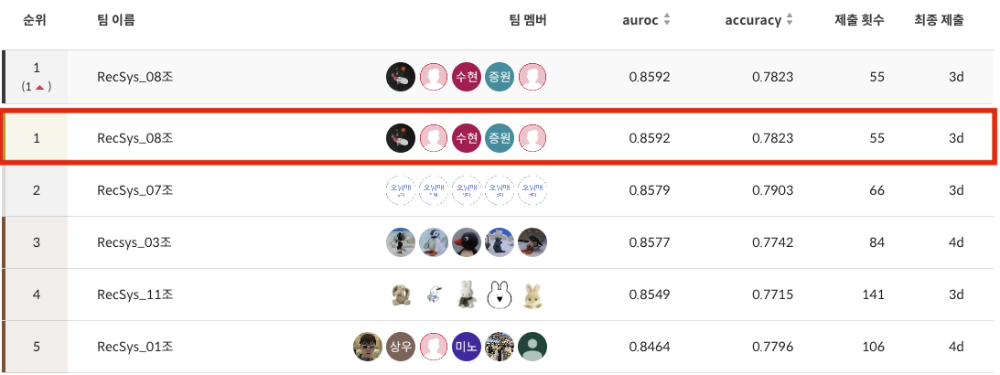

# level2_dkt-recsys-08

&nbsp;

## 📍 최종 결과
<h2>Private 1등</h2>
<h4>auroc (0.8592) / accuracy (0.7823)</h4>


&nbsp;
<h2>Public 2등</h2>
<h4>auroc (0.8243) / accuracy (0.7634)</h4>


&nbsp;

## 👼 Member
<table align="center">
  <tr height="155px">
    <td align="center" width="150px">
      <a href="https://github.com/rlawldn11703"></a>
    </td>
    <td align="center" width="150px">
      <a href="https://github.com/Sh-IT0311"></a>
    </td>
    <td align="center" width="150px">
      <a href="https://github.com/rimmiya"></a>
    </td>
    <td align="center" width="150px">
      <a href="https://github.com/AI-soyoung"></a>
    </td>
    <td align="center" width="150px">
      <a href="https://github.com/1132jjw"></a>
    </td>
  </tr>
  <tr height="80px">
    <td align="center" width="150px">
      <a href="https://github.com/ghwns82">김지우_T5063</a>
    </td>
    <td align="center" width="150px">
      <a href="https://github.com/dhkim77000">박수현_T5085</a>
    </td>
    <td align="center" width="150px">
      <a href="https://github.com/sangwu99">석예림_T5110</a>
    </td>
    <td align="center" width="150px">
      <a href="https://github.com/y2r1m">임소영_T5172</a>
    </td>
    <td align="center" width="150px">
      <a href="https://github.com/AI-soyoung">전증원_T5185</a>
    </td>
  </tr>
  <tr height="140px">
    <td align="center" width="150px">
      Boosting 기반 모델 적용, EDA 및 FE
    </td>
    <td align="center" width="150px">
      Transformer w/o sequence 기반 모델 제작, FE
    </td>
    <td align="center" width="150px">
      Git 프로젝트 설정 및 관리, Boosting 모델 적용, FE
    </td>
    <td align="center" width="150px">
      Transformer w/ sequence 기반 모델 제작, LGBM 적용, FE
    </td>
    <td align="center" width="150px">
      FM 기반 모델들 적용, FE
    </td>
  </tr>
</table>
&nbsp;

## 📝 Project Overview
각 학생이 푼 문제와 정답 여부가 담긴 데이터를 바탕으로 최종 문제를 맞출지 틀릴지 예측하는 대회
    
    ※ DKT는 Deep Knowledge Tracing의 약자로 우리의 "지식 상태"를 추적하는 딥러닝 방법론

&nbsp;


## 🗂️ Folder Structure

```


```
## 💻 Project Report
[Wrap-Up Report Link](docs/DKT대회_RecSys_팀%20리포트(08조).pdf)

